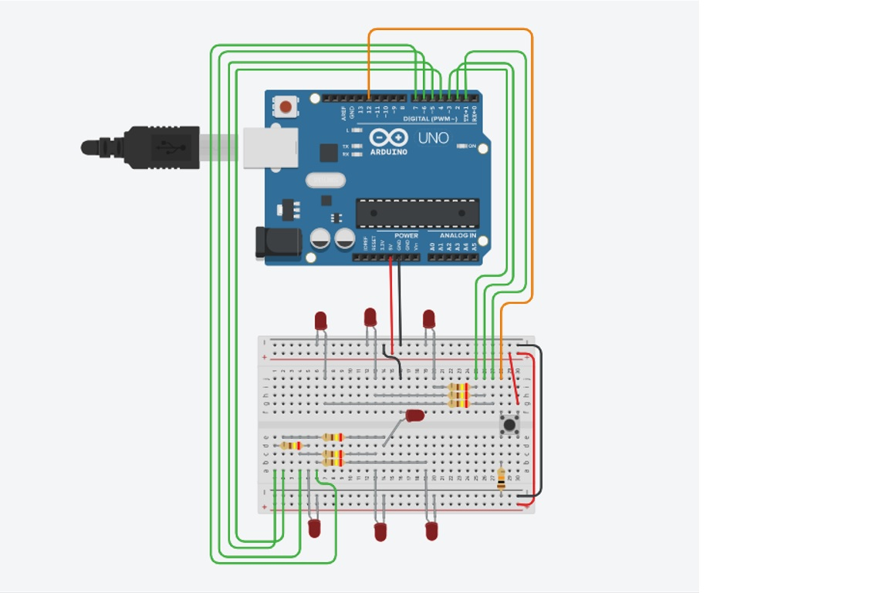
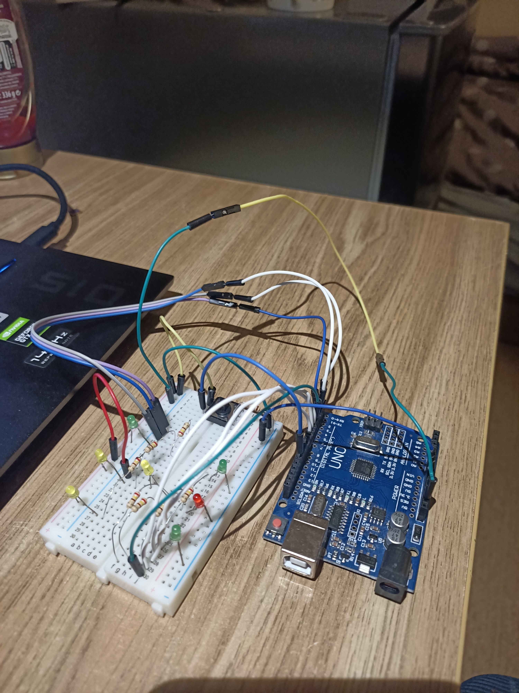

# Krystian Koszarski
 
# Projekt - TM----

# Arduino - kostka do losowania

Arduino złożone z siedmiu diód, rezystorów oraz przycisku ma za zadanie zastąpić tradycyjną kostkę do gry.

# Elementy:

- Arduino UNO R3
- 7 x LED
- Rezystor 10kΩ
- 7 x 240Ω
- przycisk
- Płytka PCB
- Przewody

# Link do elementów

https://www.amazon.pl/s?k=arduino+starter+kit+uno&language=pl_PL&adgrpid=120542344551&gclid=CjwKCAiAxJSPBhAoEiwAeO_fP5NsgK9H5EjgcM8DkEhCK-1pDx-rg_q12tZqX1yw7T9uiu6EgiW7choCBQ0QAvD_BwE&hvadid=498605349834&hvdev=c&hvlocphy=1011476&hvnetw=g&hvqmt=b&hvrand=13571669104268573028&hvtargid=kwd-298179387495&hydadcr=21907_2188669&tag=pltxtgostdde-21&ref=pd_sl_588y21jfps_b


# Schemat w programie Fritzing:



# Wygląd złożonego schematu



# Kod programu:

```cpp
void setup() {
//diody
pinMode(1,OUTPUT);
pinMode(2,OUTPUT);
pinMode(3,OUTPUT);
pinMode(4,OUTPUT);
pinMode(5,OUTPUT);
pinMode(6,OUTPUT);
pinMode(7,OUTPUT);
//przycisk
pinMode(12,INPUT);
}
int oczka=0; //Zmienna, która będzie przechowywała liczbę wylosowanych oczek
int przeskok=0; //zmienna, która będzie określała liczbę przejść przed pokazaniem właściwego wyniku
void loop() {
randomSeed(millis()); //Zwraca liczbę milisekund, które upłynęły od momentu rozpoczęcia wykonywania programu
if(digitalRead(12)==HIGH){ //Losujemy liczbę przejść 
  delay(20);
przeskok=random(3,15);
  while(digitalRead(12)==HIGH);
delay(20);
}
int czas=50; // Czas przerwy między pierwszym, a drugim wynikiem w trakcie losowania
//Pętla, która wykonuje się tyle razy, ile jest przejść
for(int i=1; i<=przeskok; i++){
digitalWrite(1,LOW);
  digitalWrite(2,LOW);
digitalWrite(3,LOW);
  digitalWrite(4,LOW);
digitalWrite(5,LOW);
  digitalWrite(6,LOW);
digitalWrite(7,LOW);
  oczka=random(1,7); //losowanie liczby oczek
//W zależności od liczby oczek zapalane są określone diody
switch (oczka){
  case 1:
digitalWrite(4,HIGH);
  break;
case 2:
    digitalWrite(1,HIGH);
digitalWrite(7,HIGH);
  break;
case 3:
    digitalWrite(1,HIGH);
digitalWrite(4,HIGH);
    digitalWrite(7,HIGH);
break;
  case 4:
digitalWrite(1,HIGH);
    digitalWrite(3,HIGH);
digitalWrite(5,HIGH);
    digitalWrite(7,HIGH);
break;
  case 5:
digitalWrite(1,HIGH);
    digitalWrite(3,HIGH);
digitalWrite(4,HIGH);
    digitalWrite(5,HIGH);
digitalWrite(7,HIGH);
  break;
case 6:
    digitalWrite(1,HIGH);
digitalWrite(2,HIGH);
    digitalWrite(3,HIGH);
digitalWrite(5,HIGH);
    digitalWrite(6,HIGH);
digitalWrite(7,HIGH);
  break;
default:
  break;
}
  delay(czas);
czas+=60; //spowolnienie przejścia kostki
}
while(digitalRead(12)==LOW); //ponowne wciśnięcie przycisku
}
```
# Filmik z działania programu 
https://youtube.com/watch?v=6hHI3PZTbhA&feature=share